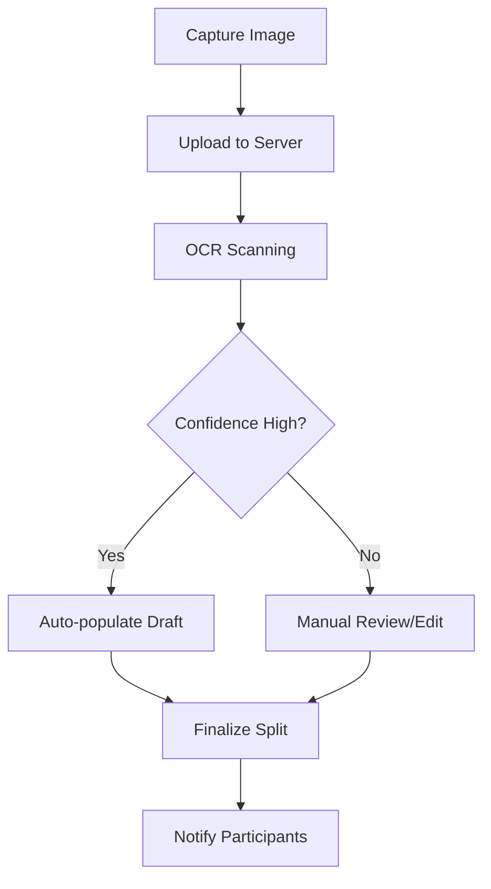

# Receipt Processing Flow (End-to-End)

StellarSplit provides a seamless experience for capturing physical receipts and turning them into digital splits. This document outlines the end-to-end journey of a receipt.

## Flow Overview



---

## 1. Capture and Upload
- **Frontend Component**: `ReceiptCaptureFlow`, `CameraCapture`, or `ReceiptUpload`.
- **Action**: User takes a photo or selects an image from their gallery.
- **Backend Endpoint**: `POST /api/receipts/upload` or `POST /api/receipts/split/:splitId/upload`.
- **Storage**: Images are processed in-memory for OCR. If a `splitId` is provided, they may be persisted to the configured storage provider (e.g., S3, local storage).

## 2. OCR Scanning
- **Service**: `ReceiptsService` using `Tesseract.js`.
- **Logic**: 
    - Image is preprocessed (grayscale, contrast enhancement).
    - OCR extracts raw text.
    - `ReceiptParser` identifies line items, quantities, prices, and totals.
- **Output**: A JSON object containing extracted items and a confidence score.

## 3. Review and Edit
- **Frontend Component**: `ParsedItemEditor`, `ReceiptParserResults`.
- **Action**: The user reviews the extracted data. If the confidence score is low (highlighted in the UI), the user is prompted to verify and correct fields.
- **Reconciliation**: A `TotalReconciliationBanner` ensures that the sum of line items (plus tax/tip) matches the grand total on the receipt.

## 4. Split Application
- **Backend Endpoint**: `POST /api/splits` (with `items` and `participants` from the OCR results).
- **Logic**: 
    - The creator assigns items to specific participants.
    - Tax and tip are distributed according to the selected `TipDistributionType` (equal or proportional).
    - Final amounts are calculated for each participant.

---

## Technical Reference

### Backend Modules
- `backend/src/receipts`: Handles storage and coordination.
- `backend/src/ocr`: Handles image processing and text extraction.

### Frontend Components
- `frontend/src/components/Receipt`: UI for managing the receipt workflow.
- `frontend/src/components/CameraCapture`: Low-level camera interaction.

### OCR Data Structure
```json
{
  "items": [
    { "name": "Margherita Pizza", "quantity": 1, "price": 18.00 }
  ],
  "subtotal": 18.00,
  "tax": 1.50,
  "tip": 3.00,
  "total": 22.50,
  "confidence": 0.92
}
```

> [!TIP]
> For better OCR results, ensure the receipt is flat, well-lit, and the text is not blurry.
